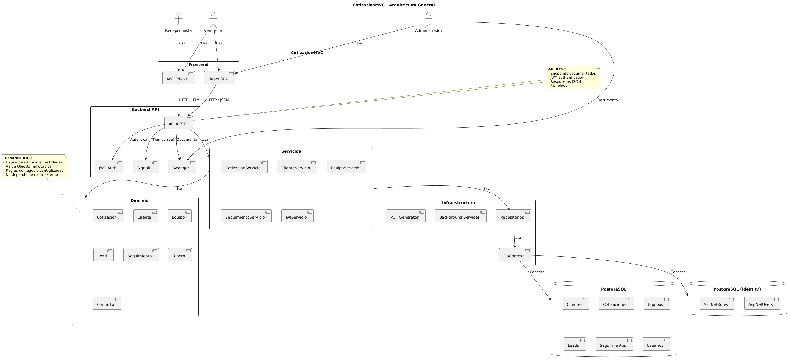
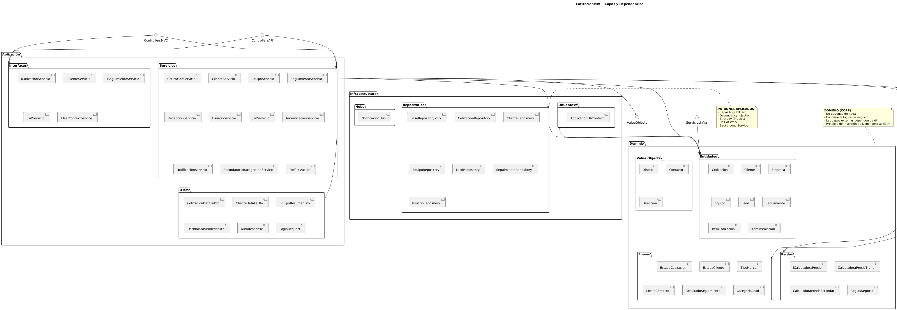
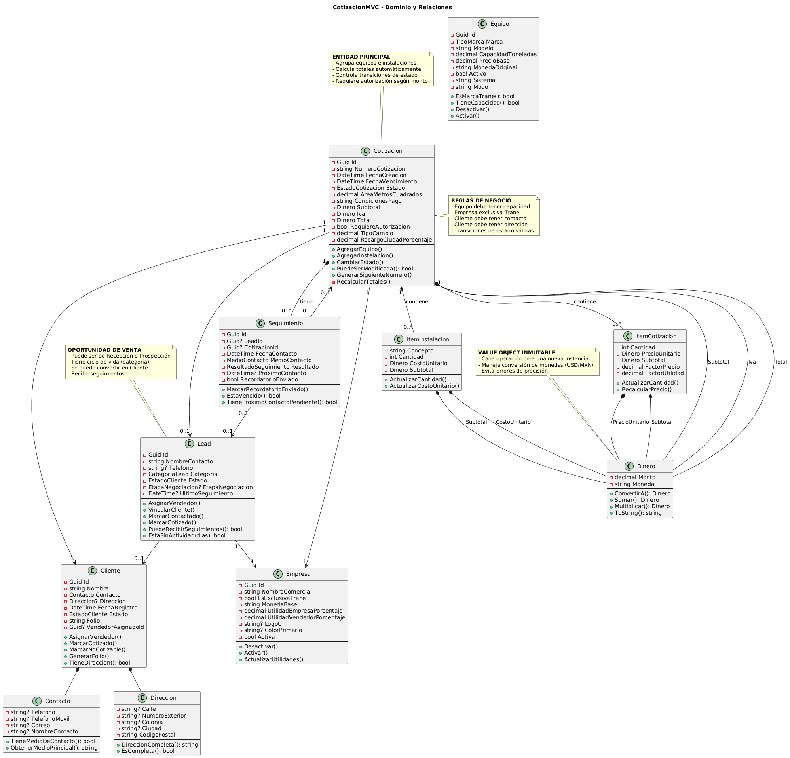
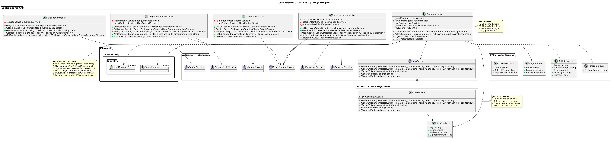

This isn't just a CRUD application. It demonstrates:

| Senior Skill | How It's Applied |
|---------------|------------------|
| **Domain-Driven Design** | Rich entities with business logic, not anemic models |
| **Clean Architecture** | Complete separation of concerns (Presentation → Application → Domain → Infrastructure) |
| **SOLID Principles** | Every principle applied intentionally, not accidentally |
| **Strategy Pattern** | Pluggable pricing engines per brand (Trane, York, Hisense, TCL) |
| **Repository Pattern** | Generic repository with specific implementations |
| **JWT Authentication** | Stateless, secure, with refresh tokens |
| **Background Services** | Automated reminders and scheduled tasks |
| **Real-Time Communication** | SignalR for instant notifications |
| **Unit Testing** | xUnit + FluentAssertions + Moq |
| **Documentation** | Swagger + UML diagrams |

> **This project proves I can design, build, and document a production-ready system from scratch.**

---

## 📋 Features

### Business Features

- **Quotation Management** — Create, edit, track, and export professional HVAC quotes
- **Equipment Catalog** — Full CRUD with multi-currency support (MXN/USD)
- **Client Management** — Multi-contact, multi-address, full history
- **Sales Pipeline** — Lead tracking with follow-ups and status transitions
- **Multi-Company** — Separate profit margins, branding, and configurations
- **PDF Generation** — Professional documents with corporate colors and logos
- **Real-Time Alerts** — SignalR notifications for follow-ups and reminders
- **Role-Based Access** — Administrator, Seller, Receptionist

### Technical Features

- **JWT Authentication** — Secure, stateless, with refresh tokens
- **Swagger/OpenAPI** — Interactive API documentation
- **Background Jobs** — Automated reminders every 15 minutes
- **Unit & Integration Tests** — Coverage for domain, services, and repositories
- **UML Diagrams** — Architecture, layers, domain, and API flow
- **Clean Architecture** — Domain has zero external dependencies

---

## 🏗️ Architecture at a Glance

### Clean Architecture + DDD

| Layer | Responsibility | Key Components |
|-------|----------------|----------------|
| **Presentation** | User Interface | MVC Controllers, Razor Views, SignalR Hubs |
| **Application** | Use Cases | Services, DTOs, Interfaces |
| **Domain** | Business Logic | Entities, Value Objects, Business Rules, Strategy Pattern |
| **Infrastructure** | Technical Details | Repositories, EF Core, PostgreSQL, Background Services |

### Architecture Diagrams

| Diagram | What It Shows |
|---------|---------------|
|  | Full system overview with actors and external systems |
|  | Layer separation and dependency flow |
|  | Rich domain model with entities, value objects, and relationships |
|  | REST API structure, JWT authentication, and endpoints |

---

## 🔐 Authentication & Authorization

### Default Credentials

| Email | Password | Role |
|-------|----------|------|
| `admin@empresa.com` | `Admin123!` | Administrator |

### Role-Based Access

| Role | Permissions |
|------|-------------|
| **Administrator** | Full system access |
| **Seller** | Quotes, clients, follow-ups |
| **Receptionist** | Client registration and assignment |

---

## 💰 Pricing Engine

The system uses a **Strategy Pattern** for price calculation per brand:

| Brand | Formula |
|-------|---------|
| **Trane** | `Price (USD) = Base × 0.31 × 1.18` |
| **Hisense / TCL** | `Price (MXN) = Base (list price)` |
| **Other Brands** | `Price (MXN) = Base × (1 + Company Profit %)` |

### Total Calculation Flow
Equipment Subtotal (USD) + City Surcharge → Total Equipment (USD)
Total Equipment (USD) → Convert to MXN

Installations (MXN)
= Subtotal (MXN)

16% VAT
= Final Total (MXN)

text

---

## 🧠 Business Rules

| Entity | Rule |
|--------|------|
| **Equipment** | Currency is restricted by brand (Trane/York → USD, Hisense/TCL → MXN) |
| **Equipment** | Capacity is required (`CapacidadToneladas > 0`) |
| **Client** | At least one contact method is required (phone, mobile, or email) |
| **Client** | Address is required |
| **Quotation** | Area must be greater than zero (`AreaMetrosCuadrados > 0`) |
| **Quotation** | State progression is linear (no backward transitions) |

---

## 🛠️ Technology Stack

| Layer | Technology |
|-------|------------|
| **Backend** | .NET 8, ASP.NET Core MVC, Entity Framework Core, PostgreSQL |
| **Authentication** | ASP.NET Core Identity, JWT, Role-Based Authorization |
| **Real-Time** | SignalR |
| **Document Generation** | QuestPDF |
| **Frontend** | Razor Views, Bootstrap 5, jQuery, Font Awesome |
| **Testing** | xUnit, FluentAssertions, Moq |
| **Architecture** | Clean Architecture, DDD, SOLID |

---

## 📁 Project Structure (Key Parts)
CotizacionMVC/
├── Controllers/
│ ├── MVC/ # HTML Views
│ └── API/ # REST API (JWT protected)
├── Models/ # Domain Layer
│ ├── Entidades/ # Rich Entities
│ ├── Valor/ # Value Objects
│ ├── Enums/ # System Enums
│ └── Reglas/ # Business Rules + Strategy Pattern
├── Servicios/ # Application Layer
│ ├── Aplicacion/ # Services + Interfaces
│ └── Infraestructura/ # External Services
├── Data/ # Infrastructure Layer
│ ├── ApplicationDbContext.cs
│ └── Repositorios/ # Repository Pattern
└── Tests/ # Unit + Integration Tests

text

---

## 🚀 Quick Start

```bash
# 1. Clone
git clone https://github.com/BaltaTech/CotizacionMVC-.git
cd CotizacionMVC

# 2. Restore
dotnet restore

# 3. Database (PostgreSQL required)
dotnet ef database update

# 4. Run
dotnet run
Default Login: admin@empresa.com / Admin123!

Swagger (API Docs): https://localhost:7271/swagger

🧪 Testing
bash
# All tests
dotnet test

# Unit tests only
dotnet test --filter "Category=Unit"
👤 Author
Airey Baltazar

GitHub: @BaltaTech

LinkedIn: linkedin.com/in/...

📄 License
MIT License

